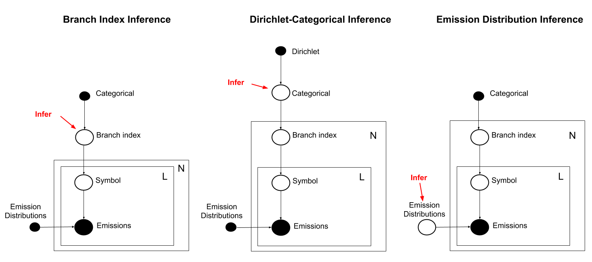

# SMoL-SHMM
This package joins the domain-specific PPL SMoL with the sparse HMM inference engine SHMM, allowing the use of SMoL models for inference on data.
See INSTALL.md for basic installation instructions.

# SMoL

SMOL repository: https://github.com/rybern/smol
SHMM repository: https://github.com/rybern/SHMM

This is meant to be a whirlwind tour of Sequence Modeling Language or SMoL, a domain specific probabalistic programming language for sequences over symbols. SMoL is currently an embedded language in Haskell, this document was generated from a Haskell Jupyter Notebook, but Haskell knowledge shouldn't be necessary.

First, I'll show how to build up distributions of sequences with SMoL by composing smaller pieces.
Then I'll demonstrate two types of inference from sequence emission data: decoding and parameter inference. Decoding allows the user to make queries on the generative process for the data in terms of the model's branching variables. Parameter inference can infer the posterior parameters in a sequence model, although this is limited at this point.

# Hello World


```haskell
-- Some imports we need (this is a comment)
import SMoL
import SMoL.Inference.SHMM
import SMoL.Tags.Utils
import Control.Monad
```

Let's start with the simplest distribution over non-empty sequences: the distribution that always returns a singleton sequence.


```haskell
-- The simplest model, besides the empty model
simplest = symbol 'H'
```

`simplest` is a SMoL expression for this distribution. We can compile it and sample from it:


```haskell
printSamples 10 (compileSMoL simplest)
```


    "H"
    "H"
    "H"
    "H"
    "H"
    "H"
    "H"
    "H"
    "H"
    "H"


Since `simplest` is deterministic, so we'll always get 'H'.

Almost as simple:


```haskell
-- Just multiple symbols in a row
elloWorld = symbols "ello world!"
```


```haskell
printSamples 10 (compileSMoL elloWorld)
```


    "ello world!"
    "ello world!"
    "ello world!"
    "ello world!"
    "ello world!"
    "ello world!"
    "ello world!"
    "ello world!"
    "ello world!"
    "ello world!"


`elloWorld` is still deterministic like `simplest`, but now the sequence has multiple symbols.

We build up more complex distributions over sequences by composing simpler ones. For example, `andThen` is a function that composes two sequence distributions by concatentating their consistituants:


```haskell
-- We can use other models as parts
helloWorld = andThen simplest elloWorld
```


```haskell
printSamples 10 (compileSMoL helloWorld)
```


    "Hello world!"
    "Hello world!"
    "Hello world!"
    "Hello world!"
    "Hello world!"
    "Hello world!"
    "Hello world!"
    "Hello world!"
    "Hello world!"
    "Hello world!"


Since `simplest`, `elloWorld` and `andThen` were deterministic, so is `helloWorld`.

`eitherOr` is another way of composing distributions that is not deterministic. The first argument to `eitherOr` first argument (0.6 in this example) is the probability of sampling from the first distribution rather than the second.


```haskell
-- Models can be probabilistic!
helloGoodbye =
    andThen 
        (eitherOr 0.6
            (symbols "Hello")
            (symbols "Goodbye, cruel"))
        (symbols " world!")
```


```haskell
printSamples 10 (compileSMoL helloGoodbye)
```


    "Hello world!"
    "Goodbye, cruel world!"
    "Goodbye, cruel world!"
    "Goodbye, cruel world!"
    "Hello world!"
    "Hello world!"
    "Hello world!"
    "Goodbye, cruel world!"
    "Hello world!"
    "Hello world!"


`helloGoodbye` now represents the distribution that returns "Hello world!" with 60% probability and "Goodbye, cruel world!" with 40% probability.

# Brief introspection

This section is safe to skip if you're not interested in the Haskell types of the SMoL expressions we're working with.

An uncompiled model is of type `ProbSeq a`, where `a` is the type of the symbol in the sequences.


```haskell
simplest :: ProbSeq Char
```


`compileSMoL` is a function from uncompiled `ProbSeq` to the matrix representation of the distribution, `MatSeq`.


```haskell
compileSMoL :: forall s. Eq s => ProbSeq s -> MatSeq s
```


A compiled model is of type `MatSeq a`, where `a` is the type of the symbol in the sequences.


```haskell
simplestC = compileSMoL simplest
```


```haskell
simplestC :: MatSeq Char
```


If we print the value of an uncompiled value like `simplest` from earlier, we get a SMoL AST expression.


```haskell
simplest
```


    symbol ('H')


If we print a compiled value, we get the actual matrix form of the distribution as well as some bookkeeping.


```haskell
simplestC
```


    MatSeq {trans = SM SparseMatrix 2x2
    1.0	0.0
    0.0	1.0
    , stateLabels = [StateLabel {stateLabel = 'H', stateTag = StateTag 0 [], tagSet = fromList []}]}


# More tools

This section is a non-exhaustive list of functions that I've built into SMoL for manipulating and composing sequence distributions.

## `finiteDistRepeat`

Repeat an sequence distribution a random number of times according to a given distribution.


```haskell
repeatModel = finiteDistRepeat [0, 0.1, 0.4, 0, 0.3, 0.2] (andThen (symbols "la") (eitherOr 0.5 (symbols ", ") (symbols "! ")))

printSamples 10 (compileSMoL repeatModel)
```


    "la, la, "
    "la, la! "
    "la, la! "
    "la! la! la, la, "
    "la, "
    "la, la! "
    "la, la! la, la! la! "
    "la, la, "
    "la, la, "
    "la, la, "


## `finiteDistOver`

Choose a sequence distribution at random according to a given distribution. Generalizes `eitherOr`


```haskell
branchModel = andThen (symbols "Today, I like ") $
    finiteDistOver [
        (symbols "bananas.", 0.4)
      , (symbols "apples.", 0.4)
      , (symbols "grapes.", 0.2)
    ]
printSamples 10 (compileSMoL branchModel)
```


    "Today, I like apples."
    "Today, I like bananas."
    "Today, I like apples."
    "Today, I like apples."
    "Today, I like bananas."
    "Today, I like apples."
    "Today, I like bananas."
    "Today, I like apples."
    "Today, I like apples."
    "Today, I like apples."


## `skip`

`skip n` is a special symbol that, when emitted, skips the next `n` symbols. `skip 0` doesn't do anything.

`possibly`, also shown below, emits nothing with the given probability.


```haskell
skipModel = andThen (possibly 0.5 (skip 3)) (symbols "do i eat fruit")
printSamples 10 (compileSMoL skipModel)
```


    "do i eat fruit"
    "i eat fruit"
    "do i eat fruit"
    "do i eat fruit"
    "i eat fruit"
    "i eat fruit"
    "do i eat fruit"
    "i eat fruit"
    "do i eat fruit"
    "do i eat fruit"


## `skipDist`

Insert a `skip n`, where `n` is drawn from a given distribution, before each symbol of the given sequence distribution.


```haskell
skipDistModel = skipDist [0.2, 0.5, 0.2, 0.1] (symbols "do i eat fruit")
printSamples 10 (compileSMoL skipDistModel)
```


    "di eatfui"
    "doieatt fruit"
    "doo  t ruutt"
    "dd ii e uitt"
    "oo i aatfrri"
    "doi  t uiit"
    "o eaa ffrrrit"
    "o   ea fruitt"
    "d ieeaat  fritt"
    "o eat ffrruii"


## `collapse`

Transform each constituant sequence in a given distribution to the sequence of sliding windows (or De Bruijn graph nodes) of a given length.


```haskell
-- Read: collapse 3 (symbols "do i eat fruit")
collapseModel = collapse undefined (foldl1 (++)) 3 (symbols (map (:[]) "do i eat fruit"))
printSamples 10 (compileSMoL collapseModel)
```


    ["do ","o i"," i ","i e"," ea","eat","at ","t f"," fr","fru","rui","uit"]
    ["do ","o i"," i ","i e"," ea","eat","at ","t f"," fr","fru","rui","uit"]
    ["do ","o i"," i ","i e"," ea","eat","at ","t f"," fr","fru","rui","uit"]
    ["do ","o i"," i ","i e"," ea","eat","at ","t f"," fr","fru","rui","uit"]
    ["do ","o i"," i ","i e"," ea","eat","at ","t f"," fr","fru","rui","uit"]
    ["do ","o i"," i ","i e"," ea","eat","at ","t f"," fr","fru","rui","uit"]
    ["do ","o i"," i ","i e"," ea","eat","at ","t f"," fr","fru","rui","uit"]
    ["do ","o i"," i ","i e"," ea","eat","at ","t f"," fr","fru","rui","uit"]
    ["do ","o i"," i ","i e"," ea","eat","at ","t f"," fr","fru","rui","uit"]
    ["do ","o i"," i ","i e"," ea","eat","at ","t f"," fr","fru","rui","uit"]


# Example application: MinION Sequencer

SMoL was originally motivated by the problem of genotyping DNA given the singal from the Oxford Nanopore Technologies MinION Sequencer. Using SMoL, I can write a very concise and expressive solution to this decoding problem.

DNA is fed into the MinION machine, and a signal is read out. The goal is to be able to use prior information about the input DNA, represented by a SMoL expression, and transform it to a signal-level model, another SMoL expression. To accomplish this, we encode the domain-specific knowledge about how the MinION works - we can encapsulate this knowledge here, and future users can use it.

The MinION signal transformation takes a sliding window over the DNA sequence, with random skips. In SMoL, this is equivalent to a `skipDist` and a `collapse`.


```haskell
type NT = Char

k = 4

ntSymbols :: [NT] -> ProbSeq [NT]
ntSymbols = symbols . map (:[])

-- Here is the function we want: map from DNA level models to signal level models.
minion :: ProbSeq [NT] -> ProbSeq [NT]
minion = skipDist [0.4, 0.3, 0.2, 0.1]
       . collapse undefined (foldl1 (++)) k

```

Below is an example of how the MinION transfors a DNA sequence. In this case, we know the DNA sequence for sure, and we take 10 samples.


```haskell
printSamples 10 . compileSMoL $ minion (ntSymbols "ACGTACACGTATGAC")
```


    ["CGTA","ACAC","CACG","CACG","ACGT","CGTA","ATGA","ATGA","ATGA","ATGA","ATGA","TGAC"]
    ["ACGT","ACGT","ACGT","GTAC","GTAC","GTAC","GTAC","TACA","ACAC","ACAC","ACAC","ACGT","ACGT","ACGT","GTAT","TATG","TGAC","TGAC","TGAC","TGAC"]
    ["CGTA","CGTA","ACAC","ACAC","ACAC","ACAC","ACGT","CGTA","CGTA","CGTA","GTAT","TATG","TGAC","TGAC","TGAC","TGAC"]
    ["ACGT","ACGT","CGTA","CGTA","GTAC","GTAC","TACA","ACAC","ACGT","ACGT","GTAT","TATG","ATGA","TGAC"]
    ["GTAC","TACA","CACG","CGTA","CGTA","CGTA","ATGA","ATGA","ATGA"]
    ["ACGT","ACGT","GTAC","GTAC","ACAC","ACGT","CGTA","CGTA","ATGA"]
    ["GTAC","ACAC","CACG","ACGT","ACGT","CGTA","GTAT","GTAT","GTAT","TATG","ATGA"]
    ["CGTA","TACA","ACAC","ACAC","ACAC","ACGT","ACGT","ACGT","CGTA","GTAT","GTAT","GTAT","ATGA","ATGA","TGAC","TGAC"]
    ["ACGT","GTAC","ACAC","ACAC","ACAC","CACG","CACG","ACGT","GTAT","TATG","TATG","ATGA","TGAC"]
    ["GTAC","GTAC","TACA","TACA","TACA","TACA","TACA","TACA","ACAC","CACG","CACG","ACGT","ACGT","GTAT","TATG","ATGA","ATGA","TGAC"]


You can get the idea from the samples - MinION events are 4-wide sliding windows over the input sequence, with random skips and random stalls. The MinION machine's signal is translated into a distribution over these 4-tuples at each time point, which is the matrix passed to SMoL.

# Inference: Decoding


```haskell
So far, we've defined sequence distributions and sampled from them. We can also do two kinds of inference on sequence data. Let's start with decoding.

We can take a SMoL expression defining our model and some data describing a sequence of distributions over symbols, and we can calculate high-level queries on the process that generated the data.

Below, I define a SMoL model and keep references to 'decision' points in the generative process.
```


```haskell
model :: ProbSeq Char
vars :: (Tag Int, Tag Bool)
(model, vars) = runTagGen $ 
  -- The random variable "a" represents the number of times the symbol is repeated
  (ps1, a) <- finiteDistRepeatM [0.8,0.1,0.1] (symbol 'a')
  
  -- The random variable "b" represents the branch taken
  (ps2, b) <- eitherOrM 0.5 ps1 (symbol 'c')
  
  let ps = andThen ps2 (symbol 'd')
  return (ps, (a, b))

-- Sample from the model, just as before
printSamples 10 (compileSMoL model)
```


    "ad"
    "ad"
    "cd"
    "ad"
    "ad"
    "ad"
    "ad"
    "cd"
    "aaad"
    "ad"


As an example, let's generate some sample data from the model.

The matrix that's printed has a row for each point in the sequence, and a column for each symbol.


```haskell
s <- sample (compileSMoL model)
observations = simulateEmissionsUniform "abcd" 0.5 s

print s
mapM_ print . emissions $ observations
```


    "cd"


    [0.125,0.125,0.5,0.125]
    [0.125,0.125,0.125,0.5]


We can directly take the posterior over the symbols given our model and the data. There are more columns now, because instead of distributions over symbols, we now have distributions over generating states from our model.


```haskell
posterior = fullPosteriorSHMM observations (compileSMoL model)

mapM_ print posterior
```


    [0.16666666666666666,0.0,0.0,0.0,0.0,0.8333333333333333,0.0]
    [0.0,0.0,0.0,0.0,0.0,0.0,1.0]


The posterior matrix above isn't very user friendly, we would ask queries in the language of our generating model.

To this end, there is a second DSL for defining queries. Below, I define a SMoL query that uses the random variables `a` and `b`. I can query the probability of events of one or more variable, as well as conditional probabilities.


```haskell
query (a, b) = do
  aDist <- tagDist a
  
  -- p(a = 1 | b is first branch)
  anb <- condition1 b id $ event1 a (== 1)
  
  -- p(b is first branch)
  yb <- event1 b (== True)
  -- p(a > 1)
  ya <- event1 a (> 1)
  
  -- Return p(b is first branch)
  return yb
```


```haskell
-- The SMoL function runQuery takes a model with variables, a query, some data, and returns the results of the query.
runQuery :: (ProbSeq d, a) -> (a -> Query b) -> Emissions d -> b
```


```haskell
runQuery (model, vars) query observations

0.01
```

# Inference: Branch index posteriors

SMoL can also do posterior inference over the branch indices in a sequence distribution. In this section, I use a MinION inference problem as an example. I will define a true model and a prior model, and show that the prior model learns the true model from data. This example performs Short Tandem Repeat (STR) allele inference.


```haskell
strSegment = ntSymbols "ACT"

-- This function constructs a SMoL MinION model given a sub-model to define the center region.
strProblem strModel = minion $ series [
      ntSymbols "ACGTACACGTATGAC"
    , strModel
    , ntSymbols "TACCAGTTGACAGAT"
    ]
```


```haskell
-- The true model repeats the "ACT" sequence exactly 3 times.
strTruth = strProblem (repeatSequence 3 strSegment)
strTruthC = compileSMoL strTruth
```


```haskell
-- This function constructs a model given a prior distribution over the number of "ACT" repeats.
-- The parameter is what we're going to infer.
strModel :: [Prob] -> (ProbSeq [NT], Tag Int)
strModel prior = runTagGen $ do
    (ps, repeatVar) <- finiteDistRepeatM prior strSegment
    return (strProblem ps, repeatVar)

-- Define a query that just returns the infered parameter to the model.
strQuery :: Tag Int -> Query [Prob]
strQuery repeatVar = do
    posteriorDist <- tagDist repeatVar
    let (Just distList) = sequence (map (flip Map.lookup posteriorDist) [1..4])
    return distList
```


```haskell
-- This expression randomly generates a sample from the true distribution.
simulateSTR :: IO (Emissions [NT])
simulateSTR = do
    s <- sample strTruthC
    return (simulateEmissionsUniform (minionSymbols k) 0.5 s)
```


```haskell
sim1 <- simulateSTR
```


```haskell
-- This SMoL function takes as input:
--    1. A function from the parameter to a model with random variables
--    2. A function from random variables to a SMoL query
--    3. A first, prior setting for the parameter
--    4. A set of sequence data matricies to learn from
-- And returns as output the final parameter.

updates :: (a -> (ProbSeq b, c)) -> (c -> Query a) -> a -> [Emissions b] -> a
```


```haskell
-- Get 5 simulated data matricies
simulations <- replicateM 5 simulateSTR

-- Run inference
updates strModel strQuery [0.25, 0.25, 0.25, 0.25] simulations
```


    [1.800368398168107e-11,2.2899140151477957e-2,0.8986217921194574,7.847906771106108e-2]


Our model, given five noisy examples, assigned 90% posterior probability to the true model, 3 repeats of "ACT".

# PPL Class Project - New Inference

I originally set out to augment the SMoL tool with MAP inference over the branching distribution with a Dirichlet prior, which I did successfully. Additionally, I added MAP inference over the emission distributions of symbols. This second task turned out to be more challenging, since it required rewriting some of the existing SMoL inference engine to work with Automatic Differentiation.

This graphic shows an overview of the inference features that existed already in SMoL before this project (left), in contrast to the branching MAP inference (center) and emission MAP inference (right).



Previously when doing inference, I was restricted to viewing sequences as having been generated from the same set of 'decisions', or branching indices. Adding support for inference over the categorical branching distributions allows me to view sequences as having been generated completely separately. To use the genotyping application as an example, I can now model sequences from multiple sources, rather than mutiple reads from the same source and assuming that all variants are the same.

Additionally, I can infer emission distributions. This will be useful for another ongoing project.

# Inference: MAP Estimates of Dirchlet-Categorical Branch Distributions

My strategy for finding the MAP estimate of the branch distribution was to use gradient descent with Haskell's support for automatic differentiation. This not only allows for the use soft-assignment of branch parameters that SMoL produces, but would allow for non-Dirichlet priors to be dropped in. From my existing implementation, I can extract the likelihoods of the data given each possible branch parameter in a model in only one run of the expensive backward-forward algorithm. In order to avoid running the backward-forward algorithm repeatedly, I used the branch likelihoods to intermediate the branch distribution and the complex sequence model. I expressed the posterior probability of the categorical parameters in terms of the branch likelihoods (a dot product, since the branch indices are samples from the categorical), and took the product with the Dirichlet prior to find the joint. I used automatic differentiation to optimize the joint.

Below, I demonsrate the use of the new inference capability.


```haskell
import SMoL
import SMoL.Inference.SHMM
import SMoL.Tags.Utils
import Control.Monad
import SMoL.DirichletInference
import SMoL.EmissionsInference hiding (simulateEmissionsUniform)
import qualified Data.Map as Map
import Data.Map (Map)
import Data.List (intercalate)
```


```haskell
-- Boring helper functions to help with gradient descent convergence and displaying
epsilon = 0.000001
listConverged xs1 xs2 = (< epsilon) . maximum $ zipWith (\x1 x2 -> abs (x1 - x2)) xs1 xs2
mapConverged xs1 xs2 = (< epsilon) . maximum $ Map.intersectionWith (\x1 x2 -> abs (x1 - x2)) xs1 xs2

showMap :: (Show a, Show b) => Map a b -> String
showMap = intercalate "\t" . map (\(k, v) -> show k ++ ":" ++ show v) . Map.toList

showIters :: (a -> String) -> (a -> a -> Bool) -> IO [a] -> IO ()
showIters showF converged = showIters' . (map showF <$>) . (takeUntilPair converged <$>)
  where showIters' :: IO [String] -> IO ()
        showIters' its = its >>= \iters -> forM_ (zip iters [0..]) $ \(iter, n) ->
          putStrLn $ "Iteration " ++ show n ++ ":\t" ++ iter
```

## Example 1

This is a dead-simple example of branching. Simulated sequences are generated using a categorical distribution over "a", "b" or "c". Data is generated from the sequences by adding noise. The simulated data is modelled with a (not very accurate) Dirichlet prior (implicitely over a categorical distribution). The "runQueries" line runs the optimization using the data, and outputs a sequence of increasingly accurate MAP estimates of the categorical branch distribution. The estimates are printed until they converge.


```haskell
-- Sequence model to simulate symbol sequences: p(a)=0.3, p(b)=0.2, p(c)=0.5
generatingSeq = finiteDistOver $ zip [symbol 'a', symbol 'b', symbol 'c'] [0.3, 0.2, 0.5]

-- Prior sequence model, where [2, 5, 3] are dirichlet parameters for the prior of the branch categorical
modelSeq = runTagGen $ finiteDistOverDirichletM [symbol 'a', symbol 'b', symbol 'c'] [2, 5, 3]

-- Sample 1000 example symbol sequences, with noisy emissions distributions
observations = replicateM 1000 (simulateEmissionsUniform "abc" 0.95 <$> sample (compileSMoL generatingSeq))

-- Run the "branchMAPs" query, which runs an MAP optimization over the categorical branch distribution given data
dirichletExample1Iters = runQueries modelSeq branchMAPs <$> observations

-- Print the iteration until convergence
dirichletExample1 = showIters show listConverged dirichletExample1Iters
```


    Iteration 0:	[0.2,0.5,0.3]
    Iteration 1:	[0.3636569679663687,4.42067450604088e-2,0.5921362869732224]
    Iteration 2:	[0.236458779788833,0.35395430096854225,0.4095869192426248]
    Iteration 3:	[0.272784624628425,0.27114252385632637,0.4560728515152486]
    Iteration 4:	[0.2869594766319614,0.22329185194457735,0.48974867142346123]
    Iteration 5:	[0.2910090871463246,0.20124235018865855,0.5077485626650169]
    Iteration 6:	[0.2905460806949576,0.19412540054251026,0.5153285187625322]
    Iteration 7:	[0.28933004872775225,0.19234654439356433,0.5183234068786834]
    Iteration 8:	[0.28848863167352495,0.19190263194084606,0.519608736385629]
    Iteration 9:	[0.28802665173032577,0.19176931007046263,0.5202040381992116]
    Iteration 10:	[0.28779077048512597,0.19171929380363098,0.5204899357112431]
    Iteration 11:	[0.28767334859065663,0.19169746981165733,0.520629181597686]
    Iteration 12:	[0.2876154287184997,0.19168722971924587,0.5206973415622543]
    Iteration 13:	[0.2875584784018449,0.19167733758443964,0.5207641840137154]
    Iteration 14:	[0.28755950648063605,0.19167757174997138,0.5207629217693925]


We see that the estimates get reasonably close to the truth by the end.

## Example 2

This example follows from the branch index example from the other notebook. The goal is to estimate the number of short tandem repeats in DNA, given a signal from a MinION Nanopore Sequencer, which outputs a noisy sliding window. Whereas before we could only estimate the costant number of repeats from the same individual, we can now estimate the distribution of repeats from multiple individuals (the branch index is sampled repeatedly).

The true distribution here is generated by "strTruth", and the data is modelled by "strModel [2,2,2,2]", which is a very weak prior Dirichlet.


```haskell
-- THIS EXTENDS THE EXAMPLE FROM THE OTHER NOTEBOOK, I RAN THIS BEFORE I SEPARATED THE NOTEBOOKS

-- Repeat the STR segment with the given probabilities (starting with p(0)=0)
strTruth = strProblem (finiteDistRepeat [0.0, 0.15, 0.3, 0.3, 0.25] strSegment)
strTruthC = compileSMoL strTruth

-- Generate an STR model with a given Dirichlet prior, and return the random variable
strModel :: [Double] -> (ProbSeq [NT], DirichletTag)
strModel prior = runTagGen $ do
    (ps, repeatVar) <- finiteDistRepeatDirichletM prior strSegment
    return (strProblem ps, repeatVar)

-- Randomly sample from the true model, with noisy emissions
simulateSTR :: IO (Emissions Double [NT])
simulateSTR = do
    s <- sample strTruthC
    return (simulateEmissionsUniform (minionSymbols k) 0.9 s)

-- Learn the distribution of repeats with a weak prior
dirichletExample2a = showIters show  listConverged $
  runQueries (strModel [2, 2, 2, 2]) branchMAPs <$> replicateM 100 simulateSTR

dirichletExample2a
```


    Iteration 1:	[0.13837596670598415,0.2847074607600655,0.28438337223704707,0.29253320029690333]
    Iteration 2:	[0.16563291897743118,0.2760272359235872,0.2744737253320037,0.28386611976697795]
    Iteration 3:	[0.16400156101681632,0.2768096214710397,0.27435454450462166,0.28483427300752223]
    Iteration 4:	[0.16385787331028565,0.2770147426724063,0.27390950520741253,0.28521787880989563]
    Iteration 5:	[0.16384594063460103,0.27712502966218655,0.2735442836219793,0.2854847460812331]
    Iteration 6:	[0.16384449588359212,0.27719918931818693,0.27326729778847253,0.2856890170097485]
    Iteration 7:	[0.16384395573601382,0.2772515195682989,0.27305848029170465,0.2858460444039826]
    Iteration 8:	[0.16384356716429024,0.2772891935805701,0.27290093584962377,0.28596630340551593]
    Iteration 9:	[0.1638432614281866,0.27731668443579355,0.27278194967723834,0.2860581044587815]
    Iteration 10:	[0.16384302149424995,0.2773369463629695,0.2726920127559536,0.28612801938682686]
    Iteration 11:	[0.16384283482391282,0.2773519916971164,0.27262399392443704,0.28618117955453376]
    Iteration 12:	[0.16384269059071976,0.2773632247258436,0.2725725305967297,0.2862215540867069]
    Iteration 13:	[0.16384246883346712,0.27738006514823876,0.27249463309226535,0.28628283292602874]
    Iteration 14:	[0.16384234948321982,0.2773885424772129,0.2724545984909195,0.2863145095486477]
    Iteration 15:	[0.1638422902805463,0.27739289205718526,0.27243399405717683,0.2863308236050916]
    Iteration 16:	[0.16384225733457622,0.2773951301168564,0.27242338927903353,0.2863392232695338]
    Iteration 17:	[0.16384224230465727,0.2773962811520699,0.2724179299581027,0.28634354658517014]
    Iteration 18:	[0.1638422328989646,0.27739687410673625,0.27241512037164994,0.2863457726226491]
    Iteration 19:	[0.16384222945476526,0.2773971788404808,0.2724136736882893,0.2863469180164646]


We see that the model does.. okay. The next example shows the same setup with a stronger prior.


```haskell
-- Learn the distribution of repeats with a stronger prior
dirichletExample2b = showIters show listConverged $
  runQueries (strModel [16, 31, 31, 26]) branchMAPs <$> replicateM 100 simulateSTR
  
dirichletExample2b
```


    Iteration 0:	[0.15384615384615385,0.2980769230769231,0.2980769230769231,0.25]
    Iteration 1:	[0.18421313508124104,0.28704945979622376,0.2871678044899782,0.2415696006325571]
    Iteration 2:	[0.16172198391306225,0.2943017517575359,0.2943897114096955,0.2495865529197065]
    Iteration 3:	[0.17689561328879155,0.28957440861676453,0.28936120615776817,0.24416877193667583]
    Iteration 4:	[0.1657957245333616,0.2930883734110637,0.29303940117896304,0.24807650087661162]
    Iteration 5:	[0.1735317742305609,0.29065758704435257,0.29048800938102,0.24532262934406662]
    Iteration 6:	[0.1679312780500983,0.2924263867006909,0.29234433504886953,0.24729800020034126]
    Iteration 7:	[0.17188557986163738,0.29118143866152196,0.29103873599495866,0.2458942454818821]
    Iteration 8:	[0.16904063255984972,0.29207921786341484,0.29198079151870354,0.24689935805803193]
    Iteration 9:	[0.1710612181348811,0.29144258770530956,0.29131310410379296,0.24618309005601635]
    Iteration 10:	[0.16961248533893972,0.2918995723236985,0.29179254767152324,0.24669539466583867]
    Iteration 11:	[0.17064435030496417,0.291574346257382,0.29145142822248393,0.2463298752151699]
    Iteration 12:	[0.169905867615814,0.29180723974415534,0.2916957473273504,0.24659114531268025]
    Iteration 13:	[0.17043259376134334,0.29164119610638556,0.291521581002484,0.2464046291297871]
    Iteration 14:	[0.17005598630942478,0.291759952134083,0.2916461581215192,0.246537903434973]
    Iteration 15:	[0.17032479296959174,0.2916752069728911,0.2915572650237939,0.2464427350337231]
    Iteration 16:	[0.17013269141823997,0.2917357789368819,0.29162080479180447,0.24651072485307365]
    Iteration 17:	[0.17026985448866858,0.29169253441944837,0.291575443018255,0.24646216807362797]
    Iteration 18:	[0.1701718561563278,0.29172343354104935,0.2916078557592449,0.246496854543378]
    Iteration 19:	[0.1702418409828125,0.2917013683657544,0.2915847101099911,0.24647208054144196]
    Iteration 20:	[0.17019184565425322,0.29171713177131176,0.2916012456155006,0.2464897769589344]
    Iteration 21:	[0.17022755277194757,0.29170587372084655,0.2915894362456632,0.24647713726154274]
    Iteration 22:	[0.17020204622045124,0.291713915809931,0.29159787221883804,0.24648616575077964]
    Iteration 23:	[0.17022026408983879,0.2917081718886513,0.29159184700030055,0.24647971702120935]
    Iteration 24:	[0.17020725101463063,0.2917122748298455,0.29159615088902624,0.24648432326649766]
    Iteration 25:	[0.1702165457326019,0.2917093442849034,0.29159307682354074,0.246481033158954]
    Iteration 26:	[0.17020990660335641,0.29171143755643325,0.2915952726146331,0.24648338322557722]
    Iteration 27:	[0.17021464872537137,0.2917099424037535,0.2915937042375821,0.24648170463329314]
    Iteration 28:	[0.1702112615020585,0.29171101037069447,0.2915948245086338,0.24648290361861325]
    Iteration 29:	[0.1702136809046789,0.29171024755205316,0.29159402433112824,0.24648204721213976]
    Iteration 30:	[0.1702119527710849,0.29171079241974307,0.2915945958838335,0.2464826589253385]
    Iteration 31:	[0.17021318713442593,0.29171040323452624,0.2915941876383113,0.24648222199273656]


We see that inference is easier with a prior, as expected, and that inference is possible in this odd setting.

# Inference: MAP Estimates of Emission Distributions

I implemented MAP estimates for emission distribution by rewriting the HMM-like inference algorithm for SMoL. The existing implemenation used an external C++ library for applying the Backward-Forward algorithm while taking advantage of the sparsity of the transition matrix. I replaced this implementation (for the scope of this application) with a pure-Haskell implemenation of the Forward algorithm, from which I can derive the likelihood of the data as a function of the emission parameters. Once I could express the likelihood of the data, I could compute the joint with the prior, and perform the optimization with gradient descent.

Rewriting this section in pure, parametric Haskell allowed me to use Haskell's support for automatic differentiation.

This section demonstrates learning the emission distributions of symbols, given the usual noisy time-series data and structured sequence models.


```haskell
-- Helper function for showing sequence samples
sampleEmissions generatingNorms generatingModel = do
  seq <- fst <$> sampleSeq vecDist (compileSMoL generatingModel)
  putStrLn $ "Generating sequence: " ++ show seq

  ems <- evalState (sampleNormalSequence generatingNorms seq) <$> getStdGen
  putStrLn $ "Generated emissions: " ++ show ems
```

## Example 1

Up until now, we've been dealing with data where each point is simply a distribution over each possible symbol. Now, we'll view data as a real number per time, and symbols as having a single-variate Gaussian emission.

Here's a simple example, where our sequence is "abab", the symbol "a" has emissions from Guassian(-1,1), and the symbol "b" has emissions from Guassian(1,1).


```haskell
sampleEmissions (Map.fromList [('a',(-1,1)),('b',(1,1))]) (symbols "abab")
```


    Generating sequence: "abab"
    Generated emissions: [-0.1984506676639053,1.7812933394857646,-1.53908923018402,1.8405630904808585]


The "meanDescent" function below is doing the setup for a simulation study and performing the optimization. It takes 100 sequence samples (which are always "abab" for now), and then samples a sequence of real values from those sequences 10 times each (using the distributions from the last argument, with means -1 and 1). It attempts to find the MAP estimate of the emission distribution means, using 0s as starting points and 0-centered means as priors.

This is a simple example of emission inference, the MAP estimate does converge to -1 and 1.


```haskell
emissionsExample1 = showIters showMap mapConverged $
  meanDescent 100 10 -- sample 100 symbolic sequences, and 10 emissions from each
  (symbols "abab") -- the generating and prior sequence model
  (Map.fromList [('a',0), ('b',0)]) -- the initial distribution means
  (Map.fromList [('a', (0,4)), ('b', (0,4))]) -- the distribution prior distributions (mean, stddev)
  (Map.fromList [('a',-1),('b',1)]) -- the generating emission distribution means

emissionsExample1
```


    Iteration 0:	'a':-1.5632205493494604	'b':1.6197864502629864
    Iteration 1:	'a':-0.6075798619541546	'b':0.6295654367232947
    Iteration 2:	'a':-1.1917898915532659	'b':1.234915392266104
    Iteration 3:	'a':-0.8346458695522601	'b':0.864847938975313
    Iteration 4:	'a':-1.0529780548770777	'b':1.0910805813190978
    Iteration 5:	'a':-0.9195054493953099	'b':0.9527782042612687
    Iteration 6:	'a':-1.001101007043343	'b':1.037326337111074
    Iteration 7:	'a':-0.9512193477780387	'b':0.9856396855837521
    Iteration 8:	'a':-0.9817134090085861	'b':1.0172371893494805
    Iteration 9:	'a':-0.9630715317328833	'b':0.9979207466176986
    Iteration 10:	'a':-0.9744678356143173	'b':1.009729431334587
    Iteration 11:	'a':-0.9675009545305503	'b':1.0025104502478968
    Iteration 12:	'a':-0.9717600048805861	'b':1.0069236164200333
    Iteration 13:	'a':-0.9691563276158195	'b':1.0042257238187071
    Iteration 14:	'a':-0.9707480287561949	'b':1.0058750214441268
    Iteration 15:	'a':-0.9697749770824875	'b':1.0048667594192127
    Iteration 16:	'a':-0.9703698309377035	'b':1.0054831383524123
    Iteration 17:	'a':-0.970006180045746	'b':1.0051063285748898
    Iteration 18:	'a':-0.9702284900636796	'b':1.005336682989664
    Iteration 19:	'a':-0.9700925856972479	'b':1.0051958608571951
    Iteration 20:	'a':-0.970175667858758	'b':1.0052819493873955
    Iteration 21:	'a':-0.9701248773967422	'b':1.0052293210476442
    Iteration 22:	'a':-0.9701559270346528	'b':1.0052614942319062
    Iteration 23:	'a':-0.9701369455177278	'b':1.0052418258594957
    Iteration 24:	'a':-0.9701485494528791	'b':1.0052538496887236
    Iteration 25:	'a':-0.9701414556409597	'b':1.0052464991837462
    Iteration 26:	'a':-0.9701457922877007	'b':1.0052509927541722
    Iteration 27:	'a':-0.9701431411735796	'b':1.0052482457081884
    Iteration 28:	'a':-0.9701447618742035	'b':1.005249925054659
    Iteration 29:	'a':-0.9701437710943303	'b':1.0052488984229304


## Example 2

In this section, we'll do emission distribution inference with a non-deterministic sequence model:


```haskell
exampleEmissions (Map.fromList [('a',(-1,1)),('b',(1,1))]) (eitherOr 0.5 (symbols "ab") (symbols "ba"))
```


    Generating sequence: "ba"
    Generated emissions: [0.3651256936676718,-0.9261299350874203]


There is a problem with this model, shown below in the same way as before:


```haskell
emissionsExample2a = showIters showMap mapConverged $
  meanDescent 100 10 -- sample 100 symbolic sequences, and 10 emissions from each
  (eitherOr 0.5 (symbols "ab") (symbols "ba")) -- the generating and prior sequence model
  (Map.fromList [('a',0), ('b',0)]) -- the initial distribution means
  (Map.fromList [('a', (0.0,4)), ('b', (0.0,4))]) -- the distribution prior distributions (mean, stddev)
  (Map.fromList [('a',-1),('b',1)]) -- the generating emission distribution means

emissionsExample2a
```


    Iteration 0:	'a':5.297834456115842e-2	'b':5.297834456115842e-2
    Iteration 1:	'a':1.8004359284456553e-2	'b':1.8004359284456553e-2
    Iteration 2:	'a':4.1092654252281306e-2	'b':4.1092654252281306e-2
    Iteration 3:	'a':2.5850772027426694e-2	'b':2.5850772027426694e-2
    Iteration 4:	'a':3.5912795839929436e-2	'b':3.5912795839929436e-2
    Iteration 5:	'a':2.9270287932454397e-2	'b':2.9270287932454397e-2
    Iteration 6:	'a':3.3655381043247896e-2	'b':3.3655381043247896e-2
    Iteration 7:	'a':3.0760534419327343e-2	'b':3.0760534419327343e-2
    Iteration 8:	'a':3.2671585510902046e-2	'b':3.2671585510902046e-2
    Iteration 9:	'a':3.1409993188726414e-2	'b':3.1409993188726414e-2
    Iteration 10:	'a':3.2242841245163134e-2	'b':3.2242841245163134e-2
    Iteration 11:	'a':3.169303139540642e-2	'b':3.169303139540642e-2
    Iteration 12:	'a':3.205599180403266e-2	'b':3.205599180403266e-2
    Iteration 13:	'a':3.1816381221779294e-2	'b':3.1816381221779294e-2
    Iteration 14:	'a':3.19745616452167e-2	'b':3.19745616452167e-2
    Iteration 15:	'a':3.187013785005756e-2	'b':3.187013785005756e-2
    Iteration 16:	'a':3.1939073871080755e-2	'b':3.1939073871080755e-2
    Iteration 17:	'a':3.1893565325954804e-2	'b':3.1893565325954804e-2
    Iteration 18:	'a':3.192360807644596e-2	'b':3.192360807644596e-2
    Iteration 19:	'a':3.1903775166941574e-2	'b':3.1903775166941574e-2
    Iteration 20:	'a':3.191686798610786e-2	'b':3.191686798610786e-2
    Iteration 21:	'a':3.190822467970571e-2	'b':3.190822467970571e-2
    Iteration 22:	'a':3.191393061244853e-2	'b':3.191393061244853e-2
    Iteration 23:	'a':3.1910163805286024e-2	'b':3.1910163805286024e-2
    Iteration 24:	'a':3.191265048657707e-2	'b':3.191265048657707e-2
    Iteration 25:	'a':3.191100888838066e-2	'b':3.191100888838066e-2
    Iteration 26:	'a':3.1912092599687934e-2	'b':3.1912092599687934e-2


The optimization failed to converge because the symbols are symmetrical. This is akin to attempting to fit a mixture of Gaussians clustering with the same starting points.

To solve this toy problem, there are two solutions. The first is to introduce asymmetry in the prior distributions:


```haskell
emissionsExample2b = showIters showMap mapConverged $
  meanDescent 100 10 -- sample 100 symbolic sequences, and 10 emissions from each
  (eitherOr 0.5 (symbols "ab") (symbols "ba")) -- the generating and prior sequence model
  (Map.fromList [('a',0), ('b',0)]) -- the initial distribution means
  (Map.fromList [('a', (-0.5,4)), ('b', (0.5,4))]) -- the distribution prior distributions (mean, stddev)
  (Map.fromList [('a',-1),('b',1)]) -- the generating emission distribution means
  
emissionsExample2b
```


    Iteration 0:	'a':6.854932378683323e-2	'b':0.4591743237868322
    Iteration 1:	'a':-1.7980537409380013	'b':0.8374317887140226
    Iteration 2:	'a':-0.4354854058077964	'b':1.2015769033491164
    Iteration 3:	'a':-1.2627828491673299	'b':0.888973670886968
    Iteration 4:	'a':-0.7659513335549879	'b':1.144654710797567
    Iteration 5:	'a':-1.0755356996521863	'b':0.9574632101627943
    Iteration 6:	'a':-0.881299972499825	'b':1.091177176282741
    Iteration 7:	'a':-1.0047411851225896	'b':0.9981203492061896
    Iteration 8:	'a':-0.9257056128908115	'b':1.062007310994669
    Iteration 9:	'a':-0.9766711774556309	'b':1.0186216714601741
    Iteration 10:	'a':-0.9436348736766563	'b':1.0478719047623846
    Iteration 11:	'a':-0.9651406877001455	'b':1.0282588720408747
    Iteration 12:	'a':-0.9510953341138412	'b':1.0413583821260737
    Iteration 13:	'a':-0.9602916365861104	'b':1.0326348331902007
    Iteration 14:	'a':-0.9542585524113164	'b':1.0384316509215674
    Iteration 15:	'a':-0.9582223865740058	'b':1.034585901404014
    Iteration 16:	'a':-0.9556151056327333	'b':1.0371341659391506
    Iteration 17:	'a':-0.9573315862468268	'b':1.0354471809848342
    Iteration 18:	'a':-0.9562008059841572	'b':1.0365632197888102
    Iteration 19:	'a':-0.9569461155942185	'b':1.0358252777494061
    Iteration 20:	'a':-0.9564546855707191	'b':1.0363130255726258
    Iteration 21:	'a':-0.9567788109131811	'b':1.035990740539713
    Iteration 22:	'a':-0.9565649851088697	'b':1.0362036465847726
    Iteration 23:	'a':-0.9567060697986123	'b':1.0360630215770763
    Iteration 24:	'a':-0.9566129687187614	'b':1.0361558929146755
    Iteration 25:	'a':-0.9566744115564979	'b':1.0360945648987079
    Iteration 26:	'a':-0.9566338588901976	'b':1.0361350601787962
    Iteration 27:	'a':-0.956660625384764	'b':1.0361083223650025
    Iteration 28:	'a':-0.9566429576158698	'b':1.0361259757996757
    Iteration 29:	'a':-0.9566546199545314	'b':1.036114320625044
    Iteration 30:	'a':-0.9566469215632265	'b':1.0361220154358743
    Iteration 31:	'a':-0.9566520034172585	'b':1.0361169353713087
    Iteration 32:	'a':-0.9566486487430457	'b':1.0361202891511732
    Iteration 33:	'a':-0.9566508632804821	'b':1.0361180750607177
    Iteration 34:	'a':-0.956649401375593	'b':1.0361195367422145


The second is to introduce asymmetry in the sequence model. Since we know "ab" is more likely to occur then "ba", the model learns the difference between the two states.


```haskell
emissionsExample2c = showIters showMap mapConverged $
  meanDescent 100 10 -- sample 100 symbolic sequences, and 10 emissions from each
  (eitherOr 0.75 (symbols "ab") (symbols "ba")) -- the generating and prior sequence model
  (Map.fromList [('a',0), ('b',0)]) -- the initial distribution means
  (Map.fromList [('a', (0.0,4)), ('b', (0.0,4))]) -- the distribution prior distributions (mean, stddev)
  (Map.fromList [('a',-1),('b',1)]) -- the generating emission distribution means

emissionsExample2c
```


    Iteration 0:	'a':-1.0382290118510533	'b':1.7532791648077055
    Iteration 1:	'a':-0.9001168359318837	'b':0.6068345466332241
    Iteration 2:	'a':-0.8919454952350013	'b':1.2643201697689705
    Iteration 3:	'a':-0.967862831396625	'b':0.9007999009004626
    Iteration 4:	'a':-0.8946070676147433	'b':1.1176416185642601
    Iteration 5:	'a':-0.9556771872352574	'b':0.9872020726991502
    Iteration 6:	'a':-0.9095463235251442	'b':1.0674975115947847
    Iteration 7:	'a':-0.9429350295115143	'b':1.0174251037515782
    Iteration 8:	'a':-0.9194777437354328	'b':1.0490651939020514
    Iteration 9:	'a':-0.935661665688284	'b':1.0288762387783925
    Iteration 10:	'a':-0.9246369095824277	'b':1.0418632648050747
    Iteration 11:	'a':-0.9320822074017978	'b':1.0334570345760101
    Iteration 12:	'a':-0.9270853093608795	'b':1.0389246218483155
    Iteration 13:	'a':-0.9304241431837297	'b':1.0353552602886107
    Iteration 14:	'a':-0.9282003547109309	'b':1.037691960173826
    Iteration 15:	'a':-0.9296780212172162	'b':1.0361589917875158
    Iteration 16:	'a':-0.9286978195981046	'b':1.0371662796092207
    Iteration 17:	'a':-0.9293472131825338	'b':1.0365036196174846
    Iteration 18:	'a':-0.9289173818508744	'b':1.0369399486544653
    Iteration 19:	'a':-0.9292016912002482	'b':1.0366524568229778
    Iteration 20:	'a':-0.9290137315060942	'b':1.036841975252128
    Iteration 21:	'a':-0.9291379470541734	'b':1.0367169962578693
    Iteration 22:	'a':-0.9290558803494416	'b':1.0367994368877282
    Iteration 23:	'a':-0.9291100890503854	'b':1.0367450450435705
    Iteration 24:	'a':-0.9290742872365587	'b':1.0367809365583462
    Iteration 25:	'a':-0.9290979296689128	'b':1.0367572501917406
    Iteration 26:	'a':-0.9290823182268808	'b':1.0367728831521468
    Iteration 27:	'a':-0.9290926260509562	'b':1.0367625647886756
    Iteration 28:	'a':-0.9290858203786689	'b':1.03676937562301
    Iteration 29:	'a':-0.929090313625495	'b':1.036764879847886
    Iteration 30:	'a':-0.9290873471651453	'b':1.0367678475465592
    Iteration 31:	'a':-0.9290893055979734	'b':1.0367658885072182
    Iteration 32:	'a':-0.9290880126746349	'b':1.0367671817276183


While these were very simple examples of emission distribution learning, this method should scale to real-world distributions and dataset. When I have access to the data, I will attempt to use this method to train the MinION to sequence non-naturally occuring nucleotides.
